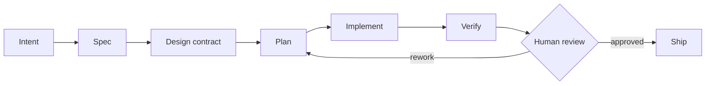

```json
{
  "role": "Tech Lead",
  "location": "Florianópolis, Brazil · UTC-3",
  "graduation": "BSc in Computer Science",

  "leadership": [
    "technical direction for a platform team",
    "roadmap and prioritization alongside product",
    "sprint planning and delivery cadence",
    "code-review culture and pair programming",
    "mentoring and unblocking engineers",
    "delivery against OKRs for internal and external clients"
  ],

  "systemDesign": [
    "microservices and service boundaries",
    "event-driven messaging between services",
    "shared internal libraries as platform building blocks",
    "design systems as a cross-team contract",
    "infrastructure as code and CI/CD pipelines",
    "performance, scalability and observability"
  ],

  "aiEngineering": [
    "agent harness design: skills, subagents, slash-commands",
    "context engineering for long-running agent sessions",
    "MCP servers for tool and data access",
    "deterministic multi-agent workflows"
  ],

  "stack": {
    "languages": ["TypeScript", "Java"],
    "backend":   ["Spring Boot", "NestJS", "Fastify", "Express"],
    "frontend":  ["React", "Next.js"],
    "data":      ["PostgreSQL", "MongoDB", "Prisma"],
    "apis":      ["REST", "GraphQL"],
    "messaging": ["Kafka", "SQS"],
    "infra":     ["Docker", "Terraform", "AWS", "GCP", "Vercel"]
  }
}
```

## How I work with AI



##

<p align="center">

 
</p>

<!--- https://devicon.dev/ -->

<p align="center">
  
</p>

<p align="center">
  <sub><b>Languages</b></sub><br><br>
  
  
  
</p>

<p align="center">
  <sub><b>Backend</b></sub><br><br>
  
  
  
  
  
  
  
</p>

<p align="center">
  <sub><b>Frontend</b></sub><br><br>
  
  
  
  
  
  
  
  
  
  
  
</p>

<p align="center">
  <sub><b>Mobile</b></sub><br><br>
  
  
</p>

<p align="center">
  <sub><b>Data &amp; APIs</b></sub><br><br>
  
  
  
  
  
  
  
</p>

<p align="center">
  <sub><b>Infra &amp; platform</b></sub><br><br>
  
  
  
  
  
  
  
  
</p>

<p align="center">
  <sub><b>Quality &amp; observability</b></sub><br><br>
  
  
  
  
  
</p>

<p align="center">
  <sub><b>Tooling</b></sub><br><br>
  
  
  
  
  
  
  
  
  
</p>

##

<div align="center"><br>
  <a href="https://www.linkedin.com/in/adrianodev97" target="_blank"></a>
  <a href = "mailto:adrianojunior.dev97@gmail.com" target="_blank"></a>
  <a href="https://t.me/adrianodev97" target="_blank"></a>

##

<picture>
  <source media="(prefers-color-scheme: dark)" srcset="https://raw.githubusercontent.com/adrianodev97/adrianodev97/output/github-contribution-grid-snake-dark.svg">
  <source media="(prefers-color-scheme: light)" srcset="https://raw.githubusercontent.com/adrianodev97/adrianodev97/output/github-contribution-grid-snake.svg">
  
</picture>

</div>

